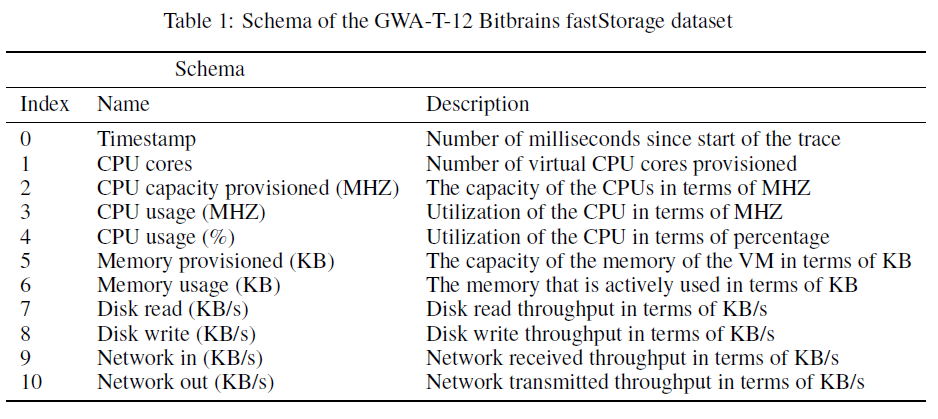
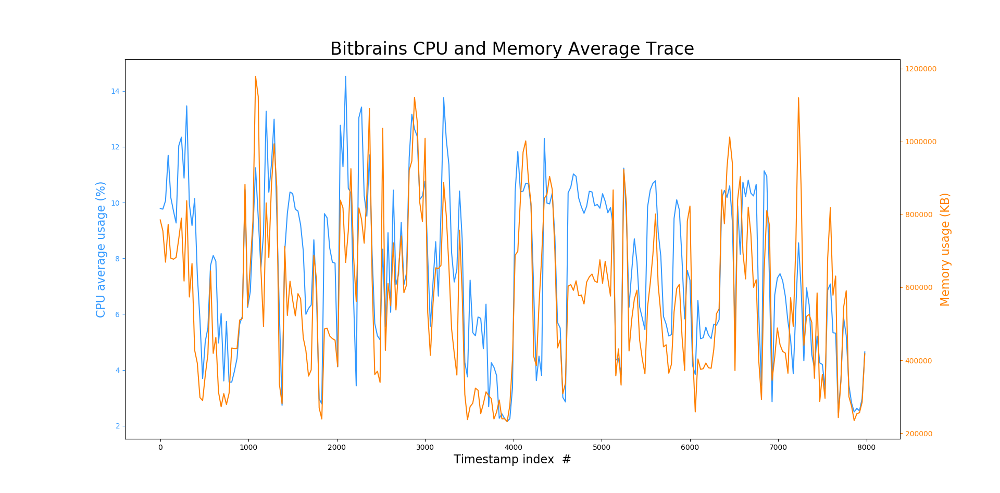
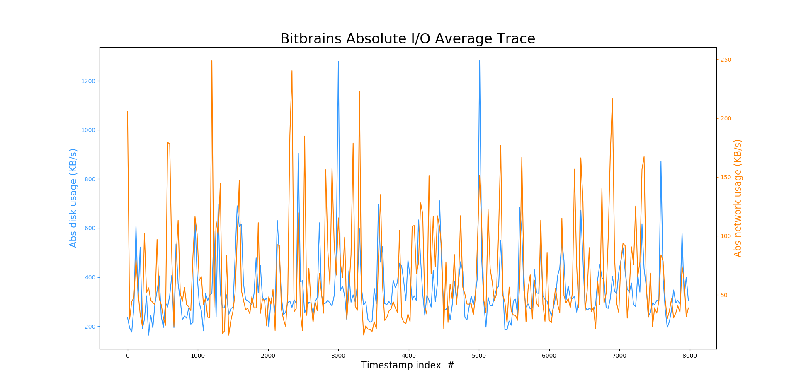
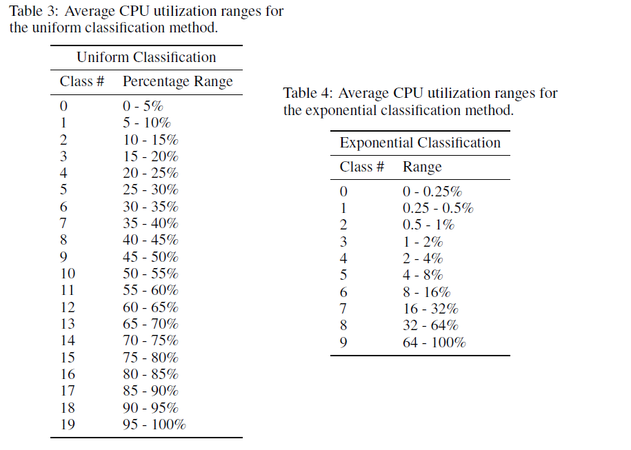
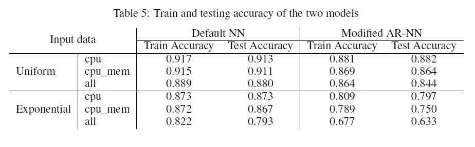
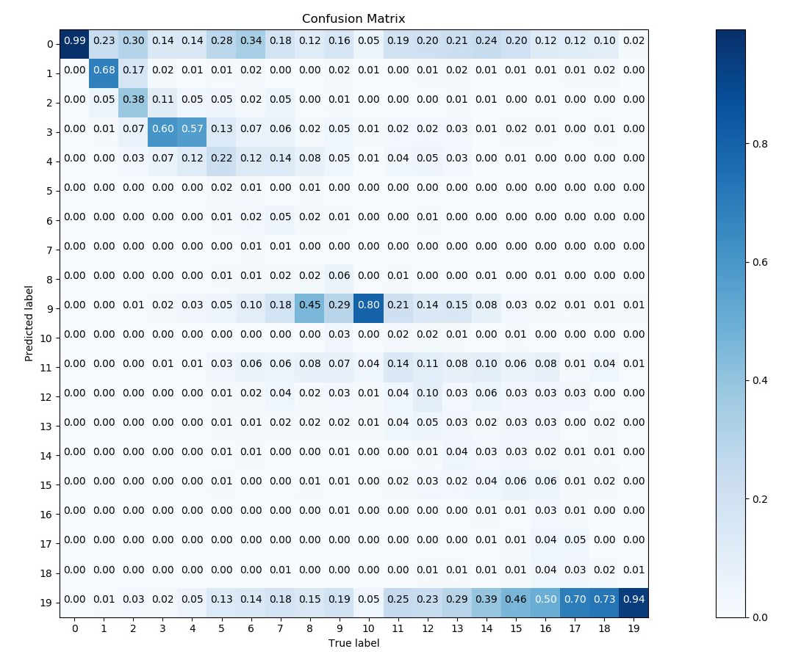
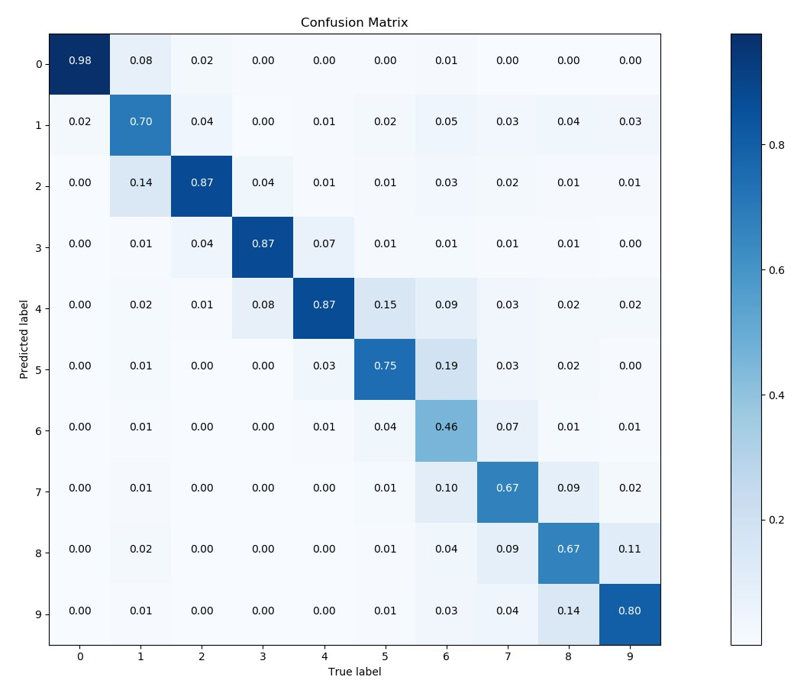

# Neural Network Prediction of Virtual Machine Workloads

### By Anthony Kwan and Fei Pan

This project attempts to investigate whether neural networks are effective at predicting future average CPU utilization based on previous resource utilization. We used a neural network trained through supervised learning by using real VM workload traces. Results indicated high accuracy, resulting in a train accuracy of 91.74\% and a test accuracy 91.34\% with the MLP neural network on the uniform 20 classes dataset.

# Description of Data

To train our neural networks we used the **fastStorage** dataset from the GWA-T-12 Bitbrains workload trace. Bitbrains is a service provider that specializes in managed hosting and business computation for enterprises. Customers include many major banks (ING), credit card operators (ICS) and insurers (Aegon). **fastStorage**, consists of the individual traces of 1,250 VMs that are used in the software applications hosted within the Bitbrains data centre. These traces were stored in .csv files with the schema shown in the Table 1 below. 

Each of these .csv files contained roughly 43 minutes worth entries, each row seperated by 300 ms. A visualization of this dataset is show in Figures 1 and 2 below. 

#### Figure 1: An illustration of the average CPU and memory utilization across all of the 1,250 Bitbrains fastStorage VMs.

#### Figure 2: An illustration of the absolute value of the average I/O utilization across all of the 1,250 Bitbrains fastStorage VMs. This values were computed by abs(input - output).

# Data Preprocessing/Filtering

In order for the data to match our criteria for inputs and outputs, we performed a series of filters onto the raw input data. Because our goal was to predict future CPU utilization based on past resource utilization trends, we need to preprocess the data to represent it in this manner. We first performed an averaging filter onto the raw data, grabbing the 9 second (30 rows) average resource utilization on all of the 1,250 VMs. This process converted the original raw VM trace data in 1,250 .csv files with roughly 8,600 rows of data into 1,250 .csv files with roughly 286 rows of data. From here, to get the inputs for our data, we cascaded and aggregated 10 rows of the average resource utilization for CPU, memory, disk read, disk write and network in and network out contained in these preprocessed .csv files. The cascading was performed for every entry on the filtered average raw data, excluding the final 11 entries (we use CPU utilization in the 11th row for the output). A visualization for the schema of the inputs is shown in Table 2 below. The total input dimensions is 60.

To formulate the output for the dataset, we took the average CPU utilization of the row following the 10 rows of cascading and aggregation during the formulation of inputs (11th row) and classified it into classes that represented the upper and lower bounds of the average CPU utilization. This classification was performed with using two methods: uniform and exponential. Experiments were run separately for the two classification methods. Tables 3 and 4 below show the mapping between class to average CPU utilization percent ranges for both classification methods. The uniform classification classifies the outputted average CPU utilization into 20 separate classes, each representing a uniformly sized range of CPU utilization. Class 0 starts from 0 - 5% and each corresponding class is incremented in ranges of 5%. The exponential classification classifies the outputted average CPU utilization into 10 separate classes, each class covering a range that is exponentially increasing. Because the data contained recorded several entries of VMs at an idle state consuming no resources, we wanted to create classes that would fairly represent this. The exponential classification method rebalances the data that is lower in CPU utilization by having more smaller CPU ranges in the first initial classes and larger CPU ranges in the latter classes. 

The data encapsulated within the inputs and outputs attempts to capture the all necessary data required to map previous CPU, memory, disk and network utilization to future CPU usage. 

# Formal Description

The problem we attempt to solve can be summarized as follows: For a virtual machine, given a time and a history of the utilization of computational resources (e.g. CPU, memory, disk I/O bandwidth and network traffic) before t, we try to predict the CPU utilization at time t. As shown in previous sections, the input data has a complex structure, which requires a high dimensional function to describe. Thus, we choose to use neural network for this project. 

We have tried both regression models, including RNN and AR-NN (autoregressive neural network), and classification models, including default neural network from scikit-learn library and a modified AR-NN created by our own. During our preliminary experiment, we found that RNN takes significantly longer time to train. Neither RNN nor AR-NN gives reasonable result as the mean squared error is too large. Thus, in this report, we only focused on the other two classification models: Neural Network MLP Classifier and Autoregressive Neural Network

# Performance Evaluation and Results

We have tested our two models on both uniform and exponential classified data. For each type, we provide three different formats of input data: *cpu*, where each time step only contains CPU utilization; *cpu_mem*, where each time step has both CPU and memory utilization; and *all*, where each time step has all the data including CPU, memory, disk utilization and network traffic.

Table 5 below shows the train and testing accuracy for both two neural network models. We can see that for both models, if we provide more information on each time step, the accuracy gets worse. This concludes that the extra information, i.e., memory, disk utilization and network traffic, act as noises for CPU utilization prediction. In addition, our modified AR-NN does not perform better than the default NN. This shows that the default NN is powerful enough for this kind of problems.

Furthermore, from accuracy table, it shows that both models have better performance on uniform classification than exponential classification. To better illustrate this result, we show the confusion matrix of both classifications for default NN under *cpu* data input in Figures 3 and 4 below. From Figure 3 we can see that the default NN is confused about the classes with the CPU utilization ranging above 40%: they are mistakenly classified as class 19, the highest range. This will cause waste of CPU resources if the system allocates the data according to this prediction as there will be an overallocation of resources. However, if we check the Figure 4, we can see that the default NN works good for this exponential classification. Even though the accuracy is lower, but we can see that most mis-predictions fall on the neighbor classes. Considering that in the real scenario the resource allocator tends to allocate more resources than requirement, the default NN still performs well on this classification. We also achieved a similar result with AR-NN. 

#### Figure 3: MLP Classifier under uniform classification.

#### Figure 4: MLP Classifier under exponential classification.

